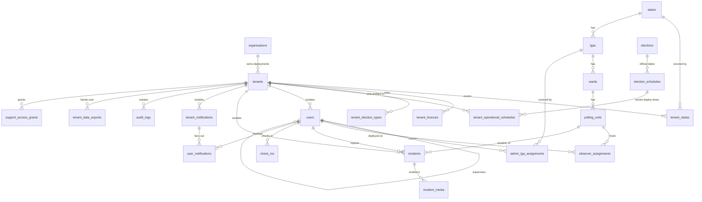

# EIP — Multi-Tenant Data Design & Migration Plan (v2)

> **Platform**: Election Intelligence Platform (EIP) — Cybernet Systems Limited
> **Backend**: Laravel 11 · PHP 8.2+ · MySQL 8.0.16+ (CHECK constraints required)
> **Model**: Full multi-tenancy. Every political party or neutral organisation that buys the platform gets its own isolated deployment (tenant) per state, or a national deployment. Several parties can run in the **same state at the same time**, and none can ever see another's data.
> **Supersedes**: `EIP_Data_Design_Plan.md` (v1). v1 allowed only one deployment per state and isolated only the `users` table; both are fixed here.

---

## 0. Core Principles (read first)

1. **The tenant is the isolation wall.** A tenant = one organisation's deployment for one state (or one national engagement). All operational data — users, assignments, incidents, media, check-ins, notifications, audit logs, exports — carries a non-null `tenant_id`.
2. **Every tenant belongs to an organisation** classified as either `political_party` or `neutral`. Every tenant-owned record therefore resolves to exactly one party or neutral organisation.
3. **Same licence fee for everyone.** Every state deployment pays the same standard software licence fee (₦8,000,000 per state, stored as a platform setting, never hard-coded). National engagements are quoted separately, as stated in the commercial proposal.
4. **Isolation is enforced in four layers**, never by remembering a `WHERE` clause: database constraints, an application global scope, storage/channel/cache namespacing, and automated tests.
5. **Cybernet staff do not read party data by default.** The platform superadmin manages organisations, tenants, licences and official election schedules and sees operational metadata (counts, health), but cannot open incidents, media or observer details unless a tenant master admin grants time-limited, audited support access. This is a key trust feature when selling to rival parties.
6. **Reference data is shared; operational data is not.** States, LGAs, wards, polling units, election types and official election schedules are shared, read-only reference data. Two parties can observe the same polling unit, and each sees only its own reports about it.
7. **The user code identifies the party.** Every user gets a human-readable, globally unique `user_code` that encodes organisation, state and role (e.g. `APC-KN-OB-00042`). The internal primary key stays a plain integer (see §5.3 for why).

---

## 1. Tenancy & Role Hierarchy

```
CYBERNET SYSTEMS (Platform owner — no tenant)
└── cybernet_superadmin
      • registers organisations (party / neutral)
      • creates tenants (state or national deployments) and records licences
      • sets OFFICIAL election schedules (presidential + state elections)
      • creates the FIRST master admin of each tenant
      • no access to tenant content without a support-access grant

ORGANISATION  (e.g. APC, PDP, LP, "Lagos Civic Watch")   type: political_party | neutral
└── TENANT — STATE deployment (e.g. "APC · Kano")          scope: state
│     └── state_master_admin      ← created by cybernet_superadmin
│           ├── state_admin       ← created by state_master_admin (LGA jurisdiction)
│           └── observer          ← created by state_master_admin (polling-unit assignment)
│
└── TENANT — NATIONAL deployment (e.g. "LP · National")    scope: national
      └── national_master_admin   ← created by cybernet_superadmin
            └── state_master_admin (one per covered state) ← created by national_master_admin
                  ├── state_admin ← created by state_master_admin
                  └── observer    ← created by state_master_admin
```

### Rules
- A user belongs to **exactly one tenant** (except `cybernet_superadmin`, who belongs to none).
- A party with deployments in Kano and Lagos has **two tenants**. Data is isolated between them as well; a cross-state view for party headquarters is possible only through a national tenant (see §13, open decision D1).
- **Only the state master admin creates state admins and observers** within their tenant and state.

### Role Definitions

| Role slug | Belongs to | Scope | Created by | Key privileges |
|---|---|---|---|---|
| `cybernet_superadmin` | Platform | All tenants (metadata only) | Seeded | Organisations, tenants, licences, official schedules, first master admin, platform health |
| `national_master_admin` | National tenant | All states covered by the tenant | `cybernet_superadmin` | Create state master admins, national dashboard, tenant settings, grant support access |
| `state_master_admin` | State or national tenant | One state within the tenant | `cybernet_superadmin` (state tenant) or `national_master_admin` | Create state admins and observers, assign LGAs and polling units, set operational (deploy) times, manage all incidents in their state |
| `state_admin` | Tenant | Assigned LGAs (1..n) | `state_master_admin` | Monitor and review incidents, view and reassign observers within their LGAs |
| `observer` | Tenant | Assigned polling unit(s) | `state_master_admin` | Check in, report incidents with evidence, receive countdowns |

### Mapping from the current (v1 / live) roles

| Current role (live system) | New role | Notes |
|---|---|---|
| Super Admin | `cybernet_superadmin` | |
| National Admin | `national_master_admin` | |
| State Coordinator | `state_master_admin` | |
| LGA Supervisor | `state_admin` | |
| Ward Supervisor | `state_admin` | Ward-level scoping deferred (open decision D4) |
| Observer | `observer` | Remove default `observers.track-location`; continuous tracking needs a contracted purpose |

---

## 2. Data Classification

| Class | Tables | Has `tenant_id`? | Who writes |
|---|---|---|---|
| **Platform** | `organisations`, `tenants`, `tenant_states`, `tenant_licences`, `tenant_election_types`, `platform_settings`, `purge_records`, `support_access_grants` | No (they define tenants) | `cybernet_superadmin` (grants: master admins) |
| **Shared reference** | `states`, `lgas`, `wards`, `polling_units`, `elections`, `election_schedules` | No | Seeders / `cybernet_superadmin` |
| **Tenant-owned** | `users` (except superadmin), `user_code_sequences`, `admin_lga_assignments`, `observer_assignments`, `tenant_operational_schedules`, `incidents`, `incident_media`, `check_ins`, `tenant_notifications`, `user_notifications`, `audit_logs` (tenant rows), `tenant_data_exports` | **Yes, NOT NULL** | Tenant users only |

---

## 3. Entity Relationship Diagram



---

## 4. Platform Tables

### 4.1 `organisations` — Parties and neutral organisations

```sql
organisations
  id                    bigint PK
  uuid                  char(36) UNIQUE
  name                  varchar(255)             -- "All Progressives Congress"
  short_code            varchar(10) UNIQUE       -- "APC" (used in tenant codes and user codes)
  type                  enum(political_party, neutral)
  neutral_category      enum(civic_organisation, government, individual_sponsor, other) NULL
                                                 -- required when type = neutral, NULL otherwise
  registration_ref      varchar(100) NULL        -- INEC party registration / CAC number
  logo_path             varchar(255) NULL
  contact_name          varchar(255) NULL
  contact_email         varchar(255) NULL
  contact_phone         varchar(30)  NULL
  status                enum(active, suspended) DEFAULT 'active'
  created_by            bigint FK → users.id     -- cybernet_superadmin
  created_at, updated_at

  CHECK ((type = 'neutral') = (neutral_category IS NOT NULL))
```

### 4.2 `tenants` — Deployments (the isolation boundary)

```sql
tenants
  id                    bigint PK
  uuid                  char(36) UNIQUE          -- used in storage paths and broadcast channels
  organisation_id       bigint FK → organisations.id
  scope                 enum(state, national)
  state_id              bigint FK → states.id NULL   -- required for scope = state; NULL for national
  state_key             bigint GENERATED ALWAYS AS (COALESCE(state_id, 0)) STORED
  name                  varchar(255)             -- "APC · Kano"
  slug                  varchar(100) UNIQUE      -- "apc-kano" (workspace / subdomain)
  code                  varchar(20) UNIQUE       -- "APC-KN" or "LP-NG" (prefix for user codes)
  status                enum(pending_payment, active, suspended, read_only, exported, purged)
                        DEFAULT 'pending_payment'
  max_admins            int NULL                 -- per contract; NULL = no cap
  max_observers         int NULL                 -- per contract; NULL = no cap
  engagement_starts_at  datetime NULL            -- UTC
  engagement_ends_at    datetime NULL            -- UTC
  data_handed_over_at   datetime NULL            -- client confirmed hard-drive handover
  purge_due_at          datetime NULL            -- data_handed_over_at + 30 days
  purged_at             datetime NULL
  created_by            bigint FK → users.id
  created_at, updated_at

  UNIQUE (organisation_id, scope, state_key)     -- one deployment per party per state,
                                                 -- one national deployment per party
  CHECK ((scope = 'state') = (state_id IS NOT NULL))
```

> **Multiple parties in one state** is allowed: `APC · Kano`, `PDP · Kano` and `Kano Civic Watch · Kano` are three separate tenants with the same `state_id`.

### 4.3 `tenant_states` — States covered by a tenant

Always populated: one row for a state tenant, one row per covered state for a national tenant. All state-level scoping queries use this table.

```sql
tenant_states
  id           bigint PK
  tenant_id    bigint FK → tenants.id
  state_id     bigint FK → states.id
  created_at, updated_at
  UNIQUE (tenant_id, state_id)
```

### 4.4 `tenant_licences` — Uniform licence fee per deployment

```sql
tenant_licences
  id               bigint PK
  tenant_id        bigint FK → tenants.id
  election_period  varchar(100)             -- "2027 General Elections"
  fee_basis        enum(standard_state, national_quote)
  licence_fee      decimal(14,2)            -- standard_state: copied from platform_settings at creation
  currency         char(3) DEFAULT 'NGN'
  invoice_ref      varchar(100) NULL
  status           enum(pending, paid, cancelled, expired) DEFAULT 'pending'
  paid_at          datetime NULL
  valid_from       datetime
  valid_to         datetime
  notes            text NULL
  created_by       bigint FK → users.id
  created_at, updated_at
```

> **Rule**: `fee_basis = standard_state` → `licence_fee` must equal `platform_settings.standard_state_licence_fee` at creation. This is enforced in `TenantLicenceService`, so every party pays the same fee. Field operations and infrastructure are quoted separately and are **not** stored here.
> **Rule**: a tenant can only move to `active` when it has a `paid` licence covering the current date.

### 4.5 `tenant_election_types` — Which elections a tenant is entitled to

```sql
tenant_election_types
  id             bigint PK
  tenant_id      bigint FK → tenants.id
  election_type  enum(presidential, governorship, senate, house_of_reps,
                      state_assembly, chairmanship, councillor)
  created_at, updated_at
  UNIQUE (tenant_id, election_type)
```

> A state package does **not** include presidential monitoring. Only tenants with a `presidential` row receive presidential countdowns and notifications.

### 4.6 `platform_settings`

```sql
platform_settings
  key         varchar(100) PK     -- "standard_state_licence_fee"
  value       text                -- "8000000.00"
  updated_by  bigint FK → users.id
  updated_at  timestamp
```

### 4.7 `support_access_grants` — Audited break-glass access for Cybernet staff

```sql
support_access_grants
  id             bigint PK
  tenant_id      bigint FK → tenants.id
  granted_by     bigint FK → users.id     -- a master admin of this tenant
  granted_to     bigint FK → users.id     -- a cybernet_superadmin
  reason         text
  starts_at      datetime
  expires_at     datetime                 -- max 72 hours
  revoked_at     datetime NULL
  created_at, updated_at
```

### 4.8 `purge_records` — Deletion certificates (survive the purge; no personal data)

```sql
purge_records
  id                  bigint PK
  certificate_number  varchar(50) UNIQUE      -- "CS-DEL-2027-0001"
  tenant_uuid         char(36)
  organisation_name   varchar(255)
  tenant_name         varchar(255)
  handed_over_at      datetime
  purged_at           datetime
  purged_by           bigint FK → users.id
  row_counts          json                    -- {"incidents": 5120, "users": 6700, ...}
  storage_objects     int
  backup_expiry_note  text                    -- when the last backup containing the data expires
  created_at
```

---

## 5. Shared Reference Tables

### 5.1 `elections` — Election type catalogue

```sql
elections
  id           bigint PK
  name         varchar(255)                -- "Governorship Election"
  type         enum(presidential, governorship, senate, house_of_reps,
                    state_assembly, chairmanship, councillor)
  scope        enum(national, state) GENERATED ALWAYS AS
               (IF(type = 'presidential', 'national', 'state')) STORED
  description  text NULL
  is_active    boolean DEFAULT true
  created_at, updated_at
```

### 5.2 `election_schedules` — OFFICIAL election dates (platform-owned)

Official dates (INEC / SIEC) are facts shared by all tenants, so they are set once by `cybernet_superadmin`. They are not duplicated per party, which prevents two parties in the same state seeing different "official" dates.

```sql
election_schedules
  id                       bigint PK
  election_id              bigint FK → elections.id
  state_id                 bigint FK → states.id NULL   -- NULL = nationwide (presidential)
  title                    varchar(255)                 -- "Kano Governorship Election 2027"
  starts_at                datetime                     -- UTC; polls open
  ends_at                  datetime                     -- UTC; polls close
  accreditation_starts_at  datetime NULL                -- UTC
  status                   enum(scheduled, active, closed, postponed, cancelled) DEFAULT 'scheduled'
  postponed_from           datetime NULL
  status_reason            text NULL
  set_by                   bigint FK → users.id         -- cybernet_superadmin only
  created_at, updated_at
```

### 5.3 Why the user code, not the primary key, identifies the party

The requirement is that a user's ID shows which party they belong to. This is met with `users.user_code`, not by encoding the party into `users.id`, because:
- primary keys must never change, but a code format may need to evolve;
- sequential integer keys keep indexes and foreign keys fast;
- `user_code` is readable on ID cards, printed rosters and support calls.

**Format**: `{ORG}-{STATE}-{ROLE}-{SEQ}`

| Example | Meaning |
|---|---|
| `APC-KN-SM-001` | APC · Kano · State Master Admin #1 |
| `APC-KN-SA-004` | APC · Kano · State Admin #4 |
| `APC-KN-OB-00042` | APC · Kano · Observer #42 |
| `CVW-LA-OB-00007` | Lagos Civic Watch (neutral) · Lagos · Observer #7 |
| `LP-NG-NM-001` | LP · National · National Master Admin #1 |
| `LP-NG-KD-SM-001` | LP · National tenant · Kaduna · State Master Admin #1 |

Role codes: `NM` national master admin, `SM` state master admin, `SA` state admin, `OB` observer. For national tenants the state code is inserted after `NG`. Sequences come from `user_code_sequences`, incremented under a row lock so codes are never duplicated.

---

## 6. Tenant-Owned Tables

> Every table below has `tenant_id bigint NOT NULL FK → tenants.id` and an index beginning with `tenant_id`.
> **Cross-tenant references are impossible at the database level.** `users` carries `UNIQUE (tenant_id, id)`, and child tables reference users through **composite foreign keys** `(tenant_id, user_id) → users(tenant_id, id)`. A PDP incident can therefore never point to an APC observer, even if application code is buggy.

### 6.1 `users` — Modified

```sql
ALTER users ADD:
  organisation_id     bigint FK → organisations.id NULL   -- NULL only for cybernet_superadmin
  tenant_id           bigint FK → tenants.id NULL         -- NULL only for cybernet_superadmin
  user_code           varchar(30) UNIQUE NULL             -- NOT NULL after backfill (except superadmin)
  role_type           enum(cybernet_superadmin, national_master_admin,
                           state_master_admin, state_admin, observer) NULL  -- NOT NULL after backfill
  supervisor_id       bigint NULL                          -- reporting line only
  created_by          bigint FK → users.id NULL
  nin_encrypted       text NULL                            -- Laravel 'encrypted' cast
  nin_hash            char(64) NULL                        -- HMAC-SHA256 for per-tenant uniqueness
  profile_photo_path  varchar(255) NULL                    -- tenants/{tenant_uuid}/users/...
  deployment_status   enum(deployed, standby, off_duty) DEFAULT 'standby'

CHANGE:
  email UNIQUE        →  UNIQUE (tenant_id, email)         -- same person may exist in two tenants
                                                            -- without revealing it to either
ADD INDEXES / CONSTRAINTS:
  UNIQUE (tenant_id, id)                                    -- target for composite FKs
  UNIQUE (tenant_id, nin_hash)
  FOREIGN KEY (tenant_id, supervisor_id) → users(tenant_id, id)
  CHECK ((role_type = 'cybernet_superadmin') = (tenant_id IS NULL))
```

> `users.state_id` (existing, from migration `2026_06_15_000001`) is kept. For national-tenant state master admins it records their assigned state; it must be one of the tenant's `tenant_states`.
> `users.lga_id` from v1 is **dropped**. It duplicated what assignments already record.
> `organisation_id` is denormalised from `tenants.organisation_id` so party-level labelling and reports need no join. It is set by the model and must always match the tenant's organisation.

### 6.2 `user_code_sequences`

```sql
user_code_sequences
  tenant_id    bigint FK → tenants.id
  scope_key    varchar(20)       -- "OB", "SA", "KD-SM", ...
  next_value   int DEFAULT 1
  PRIMARY KEY (tenant_id, scope_key)
```

### 6.3 `admin_lga_assignments` — LGA jurisdiction for state admins

```sql
admin_lga_assignments
  id           bigint PK
  tenant_id    bigint NOT NULL
  user_id      bigint             -- must be role state_admin
  lga_id       bigint FK → lgas.id  -- must be in the admin's state and the tenant's states
  assigned_by  bigint             -- state_master_admin
  is_active    boolean DEFAULT true
  assigned_at  datetime
  created_at, updated_at
  UNIQUE (tenant_id, user_id, lga_id)
  FOREIGN KEY (tenant_id, user_id)     → users(tenant_id, id)
  FOREIGN KEY (tenant_id, assigned_by) → users(tenant_id, id)
```

### 6.4 `observer_assignments` — Modified

```sql
observer_assignments
  id                    bigint PK
  tenant_id             bigint NOT NULL
  observer_id           bigint
  polling_unit_id       bigint FK → polling_units.id    -- shared reference; two parties may use the same PU
  election_schedule_id  bigint FK → election_schedules.id NULL
  assigned_by           bigint
  status                enum(active, recalled, completed) DEFAULT 'active'
  assigned_at           datetime
  created_at, updated_at
  FOREIGN KEY (tenant_id, observer_id) → users(tenant_id, id)
  FOREIGN KEY (tenant_id, assigned_by) → users(tenant_id, id)
  UNIQUE (tenant_id, observer_id, polling_unit_id, election_schedule_id)
```

### 6.5 `tenant_operational_schedules` — Party-specific deploy times

The official schedule says when polls open. Each tenant's state master admin decides when *their* observers must deploy and report.

```sql
tenant_operational_schedules
  id                    bigint PK
  tenant_id             bigint NOT NULL
  election_schedule_id  bigint FK → election_schedules.id
  state_id              bigint FK → states.id NULL        -- per state in national tenants
  deploy_at             datetime                          -- UTC; "DEPLOY NOW" alert time
  first_report_due_at   datetime NULL
  briefing_notes        text NULL
  set_by                bigint
  created_at, updated_at
  UNIQUE (tenant_id, election_schedule_id, state_id)
  FOREIGN KEY (tenant_id, set_by) → users(tenant_id, id)
```

### 6.6 `incidents`

```sql
incidents
  id                    bigint PK
  uuid                  char(36) UNIQUE      -- generated on the device; makes offline sync idempotent
  tenant_id             bigint NOT NULL
  reporter_id           bigint
  polling_unit_id       bigint FK → polling_units.id
  election_schedule_id  bigint FK → election_schedules.id NULL
  category              varchar(50)
  severity              enum(low, medium, high, critical)
  description           text
  latitude, longitude   decimal(10,7) NULL
  location_accuracy_m   decimal(8,2) NULL
  captured_at           datetime              -- device time at capture
  synced_at             datetime              -- server receipt time
  verification_status   enum(unverified, verified, rejected) DEFAULT 'unverified'
  status                enum(open, investigating, escalated, resolved, closed) DEFAULT 'open'
  reviewed_by           bigint NULL
  created_at, updated_at
  FOREIGN KEY (tenant_id, reporter_id) → users(tenant_id, id)
  FOREIGN KEY (tenant_id, reviewed_by) → users(tenant_id, id)
  INDEX (tenant_id, status, severity)
  INDEX (tenant_id, polling_unit_id)
```

### 6.7 `incident_media`

```sql
incident_media
  id            bigint PK
  tenant_id     bigint NOT NULL
  incident_id   bigint
  storage_path  varchar(500)       -- tenants/{tenant_uuid}/incidents/{incident_uuid}/{file}
  mime_type     varchar(100)
  size_bytes    bigint
  sha256        char(64)           -- integrity check for evidence
  created_at, updated_at
  FOREIGN KEY (tenant_id, incident_id) → incidents(tenant_id, id)   -- needs UNIQUE(tenant_id, id) on incidents
```

### 6.8 `check_ins`

```sql
check_ins
  id                  bigint PK
  uuid                char(36) UNIQUE
  tenant_id           bigint NOT NULL
  observer_id         bigint
  polling_unit_id     bigint FK → polling_units.id
  latitude, longitude decimal(10,7)
  accuracy_m          decimal(8,2) NULL
  captured_at         datetime
  synced_at           datetime
  created_at
  FOREIGN KEY (tenant_id, observer_id) → users(tenant_id, id)
```

### 6.9 `tenant_notifications` — Scheduled broadcasts per tenant (replaces v1 `election_notifications`)

```sql
tenant_notifications
  id                    bigint PK
  tenant_id             bigint NOT NULL
  election_schedule_id  bigint FK → election_schedules.id NULL
  notification_type     enum(election_scheduled, schedule_changed, reminder_24h, reminder_1h,
                             deploy_now, polls_open, polls_closed, custom)
  recipient_role        enum(all, state_admins, observers) DEFAULT 'all'
  state_id              bigint NULL          -- limit to one state in national tenants
  title                 varchar(255)
  body                  text
  scheduled_for         datetime             -- UTC
  status                enum(pending, sending, sent, cancelled, failed) DEFAULT 'pending'
  sent_at               datetime NULL
  created_at, updated_at
  INDEX (status, scheduled_for)
```

### 6.10 `user_notifications` — Per-user inbox

```sql
user_notifications
  id                      char(36) PK (uuid)
  tenant_id               bigint NOT NULL
  user_id                 bigint
  tenant_notification_id  bigint NULL FK → tenant_notifications.id
  title                   varchar(255)
  body                    text
  data                    json NULL           -- starts_at, deploy_at, polling unit, etc.
  priority                enum(low, normal, high, critical) DEFAULT 'normal'
  read_at                 datetime NULL
  created_at, updated_at
  FOREIGN KEY (tenant_id, user_id) → users(tenant_id, id)
  INDEX (tenant_id, user_id, read_at)
```

### 6.11 `audit_logs` — Append-only activity log

```sql
audit_logs
  id            bigint PK
  tenant_id     bigint NULL          -- NULL = platform action (tenant created, licence paid, ...)
  actor_id      bigint NULL
  actor_code    varchar(30) NULL     -- snapshot of user_code
  action        varchar(100)         -- "incident.status_changed", "user.suspended", "support_access.used"
  subject_type  varchar(100)
  subject_id    bigint NULL
  changes       json NULL
  ip_address    varchar(45) NULL
  user_agent    varchar(255) NULL
  created_at    datetime
  -- no updated_at: rows are never edited; the application DB user has no UPDATE/DELETE on this table
```

### 6.12 `tenant_data_exports` — Hard-drive handover

```sql
tenant_data_exports
  id                  bigint PK
  tenant_id           bigint NOT NULL
  requested_by        bigint
  status              enum(queued, building, ready, handed_over, confirmed, failed)
  archive_checksum    char(64) NULL
  archive_size_bytes  bigint NULL
  handed_over_to      varchar(255) NULL     -- client's authorised representative
  handed_over_at      datetime NULL
  confirmed_at        datetime NULL         -- client confirmed satisfaction; purge_due_at = +30 days
  created_at, updated_at
```

---

## 7. Isolation Enforcement (four layers)

| Layer | Mechanism |
|---|---|
| **1. Database** | `tenant_id NOT NULL` on every tenant-owned table; composite foreign keys `(tenant_id, x_id)`; CHECK constraints on superadmin/tenant consistency. |
| **2. Application** | `TenantContext` singleton set by middleware from the authenticated user. A `BelongsToTenant` trait adds a global scope (`WHERE tenant_id = ?`) and fills `tenant_id` on create. Route model binding is resolved through the scope, so `/incidents/{id}` from another tenant returns **404, never 403** (no existence leak). Bypassing the scope is only possible through `TenantContext::runAsPlatform()`, which requires an active support-access grant and writes an audit log entry. |
| **3. Infrastructure** | Storage paths `tenants/{tenant_uuid}/...`, served through short-lived signed URLs. Private broadcast channels `tenant.{tenant_uuid}.*`. Cache keys prefixed `t:{tenant_id}:`. Queued jobs serialise `tenant_id` and restore `TenantContext` before running. Exports and reports are generated per tenant only. |
| **4. Verification** | An automated isolation test suite (§11) runs on every build and fails the build if any cross-tenant read, write, count, search, broadcast or file access succeeds. |

**Partisan labelling.** Reports, exports and dashboards of tenants whose organisation `type = political_party` carry the label *"Partisan monitoring by {organisation} — not independent nonpartisan observation"*, as the commercial proposal requires.

---

## 8. Access Control Matrix

Legend: ✅ allowed · ❌ denied · 🔒 only with an active support-access grant

| Action | cybernet_superadmin | national_master_admin | state_master_admin | state_admin | observer |
|---|:---:|:---:|:---:|:---:|:---:|
| Register organisation (party / neutral) | ✅ | ❌ | ❌ | ❌ | ❌ |
| Create / suspend tenant, record licence | ✅ | ❌ | ❌ | ❌ | ❌ |
| Set official election schedule | ✅ | ❌ | ❌ | ❌ | ❌ |
| View platform metadata (tenant list, counts, health) | ✅ | ❌ | ❌ | ❌ | ❌ |
| Read tenant incidents, media, observer details | 🔒 | ✅ (tenant) | ✅ (own state) | ✅ (own LGAs) | ✅ (own reports) |
| Create first master admin of a tenant | ✅ | ❌ | ❌ | ❌ | ❌ |
| Create state master admins | ❌ | ✅ (covered states) | ❌ | ❌ | ❌ |
| Create state admins | ❌ | ❌ | ✅ (own state) | ❌ | ❌ |
| Create observers | ❌ | ❌ | ✅ (own state) | ❌ | ❌ |
| Suspend / reactivate users | ✅ (master admins only) | ✅ (tenant) | ✅ (own state) | ❌ | ❌ |
| Assign LGAs to state admins | ❌ | ❌ | ✅ | ❌ | ❌ |
| Assign / reassign observers to polling units | ❌ | ❌ | ✅ | ✅ (own LGAs) | ❌ |
| Set tenant deploy times | ❌ | ✅ | ✅ (own state) | ❌ | ❌ |
| Review / verify / escalate incidents | ❌ | ✅ | ✅ (own state) | ✅ (own LGAs) | ❌ |
| Report incidents, check in, mark deployed | ❌ | ❌ | ❌ | ❌ | ✅ |
| View live map | ✅ (metadata only) | ✅ (tenant) | ✅ (own state) | ✅ (own LGAs) | ❌ |
| Receive countdown notifications | ❌ | ✅ | ✅ | ✅ | ✅ |
| Grant / revoke support access | ❌ | ✅ | ✅ (state tenants) | ❌ | ❌ |
| Request data export | ✅ (on client instruction) | ✅ | ✅ (state tenants) | ❌ | ❌ |
| Purge tenant | ✅ (after confirmed handover + 30 days) | ❌ | ❌ | ❌ | ❌ |

> Every row above is implemented as a Policy method and covered by at least one automated test.

---

## 9. Election Countdown & Notification Flow

```
cybernet_superadmin creates / updates an OFFICIAL election_schedule
        │
        ▼
ElectionScheduleChanged event → ResolveEntitledTenantsJob
        │   selects tenants WHERE
        │     status = active
        │     AND tenant_election_types contains the election type
        │     AND (schedule.state_id IS NULL OR schedule.state_id IN tenant_states)
        │
        ├──► for EACH entitled tenant (inside its own TenantContext):
        │       create tenant_notifications rows:
        │         election_scheduled / schedule_changed   (now)
        │         reminder_24h                            (starts_at − 24h)
        │         reminder_1h                             (starts_at − 1h)
        │         deploy_now                              (tenant deploy_at, default starts_at − 30m)
        │         polls_open                              (starts_at)
        │         polls_closed                            (ends_at)
        │
        └──► on postponement / cancellation:
                cancel this tenant's pending rows → regenerate from the new times

Scheduler (every minute): DispatchDueTenantNotifications
        • SELECT … WHERE status = 'pending' AND scheduled_for <= now() FOR UPDATE SKIP LOCKED
        • mark 'sending' → fan out to user_notifications in chunks of 1,000 (batch insert)
        • broadcast on private channel tenant.{tenant_uuid}.user.{user_id}
        • mark 'sent' (or 'failed' with retry)

When a state_master_admin changes deploy_at → only that tenant's deploy_now row is regenerated.
```

> **Why rows plus a scheduler instead of delayed jobs:** delayed jobs cannot be reliably cancelled when an election is postponed, and some queue drivers cap delays. Rows are visible, cancellable, auditable and sent exactly once.

### Frontend countdown (PWA)

```
GET /api/v1/observer/next-election
  → { schedule: {title, starts_at, ends_at, status},
      tenant: {deploy_at},
      assignment: {polling_unit},
      server_time }                      ← countdown uses the server clock offset, not the device clock

Before deploy_at            → "Election starts in X days HH:MM:SS"
deploy_at ≤ now < starts_at → "DEPLOY NOW — go to {polling unit}"
starts_at ≤ now < ends_at   → "POLLS OPEN — election in progress" (pulse)
now ≥ ends_at               → "Polls closed"
status = postponed          → "Postponed — new date {…}"
The last response is cached on the device so the countdown works offline.
```

---

## 10. API Surface

All routes are under `/api/v1`. Platform routes require `cybernet_superadmin`; tenant routes require an authenticated tenant user and always run inside `TenantContext`.

### Authentication
- `POST /auth/login` — `{ user_code, password }` **or** `{ workspace (tenant slug), email, password }`. Returns role, tenant, organisation and jurisdiction summary.
- `POST /auth/logout`, `GET /auth/me`

### Platform (cybernet_superadmin)
- `GET|POST /platform/organisations`, `PATCH /platform/organisations/{id}`
- `GET|POST /platform/tenants`, `PATCH /platform/tenants/{id}` (suspend, reactivate, read-only)
- `POST /platform/tenants/{id}/licences`, `PATCH /platform/licences/{id}` (mark paid)
- `POST /platform/tenants/{id}/master-admin`
- `GET|POST /platform/election-schedules`, `PATCH /platform/election-schedules/{id}` (postpone, cancel)
- `GET /platform/metrics` — per-tenant counts only, no content
- `POST /platform/tenants/{id}/purge` — only when `purge_due_at` has passed

### Tenant administration
- `GET|POST /tenant/users` (role-restricted creation), `PATCH /tenant/users/{id}` (suspend, reactivate)
- `GET|POST|DELETE /tenant/lga-assignments`
- `GET|POST|PATCH /tenant/observer-assignments`
- `GET|PUT /tenant/operational-schedules/{electionScheduleId}`
- `GET /tenant/election-schedules` — official schedules this tenant is entitled to
- `GET|PATCH /tenant/incidents`, `GET /tenant/incidents/{id}`
- `GET /tenant/map` — polling units, observers, incidents within jurisdiction
- `POST|DELETE /tenant/support-access`
- `POST /tenant/exports`, `GET /tenant/exports/{id}`, `POST /tenant/exports/{id}/confirm`

### Observer
- `GET /observer/assignment`, `GET /observer/next-election`
- `POST /observer/check-ins` (idempotent on `uuid`)
- `POST /observer/incidents`, `POST /observer/incidents/{uuid}/media` (idempotent on `uuid`)
- `GET /notifications`, `PATCH /notifications/{id}/read`

---

## 11. Seeding Plan

```
DatabaseSeeder
  1. CybernetAdminSeeder        → 1 cybernet_superadmin
  2. PlatformSettingsSeeder     → standard_state_licence_fee = 8000000.00 NGN
  3. StatesSeeder               → 36 states + FCT (37 records)
  4. LgasWardsPollingUnitsSeeder→ from existing JSON
  5. ElectionTypesSeeder        → 7 types (incl. state_assembly)
  6. RolesPermissionsSeeder     → 5 roles + permissions from §8 (Spatie, teams = tenant_id)

DemoSeeder (local / staging only — never production)
  Organisations: APC (party), PDP (party), Lagos Civic Watch (neutral), LP (party)
  Tenants:
    APC · Lagos    (state)     → 1 SM, 2 SA, 5 OB, 10 incidents
    PDP · Lagos    (state)     → 1 SM, 2 SA, 5 OB, 10 incidents   ← same state, same polling units as APC
    CVW · Lagos    (state)     → 1 SM, 1 SA, 3 OB, 5 incidents
    LP  · National (national)  → 1 NM, Lagos + Kaduna, 1 SM each, 1 SA each, 3 OB each
  Licences: all paid at the standard fee (LP at a national quote)
  Official schedules: 1 presidential, 1 Lagos governorship
```

> The demo deliberately puts **three tenants in the same state on the same polling units**. It is the fixture the isolation test suite runs against.

---

## 12. Migration Execution Order

Uses expand → backfill → enforce for existing tables, so live data is never broken.

```
Phase 1 — Platform foundation
  [M01] 2026_09_27_010001_create_organisations_table
  [M02] 2026_09_27_010002_create_tenants_table
  [M03] 2026_09_27_010003_create_tenant_states_table
  [M04] 2026_09_27_010004_create_tenant_licences_table
  [M05] 2026_09_27_010005_create_tenant_election_types_table
  [M06] 2026_09_27_010006_create_platform_settings_table
  [M07] 2026_09_27_010007_create_support_access_grants_table
  [M08] 2026_09_27_010008_create_purge_records_table

Phase 2 — Official elections (shared reference)
  [M09] 2026_09_27_010009_create_elections_table
  [M10] 2026_09_27_010010_create_election_schedules_table

Phase 3 — Users (expand → backfill → enforce)
  [M11] 2026_09_27_010011_expand_users_for_tenancy            (all new columns NULLABLE)
  [M12] 2026_09_27_010012_backfill_users_tenancy              (data migration: legacy tenant,
                                                               role mapping §1, user_code generation)
  [M13] 2026_09_27_010013_enforce_users_tenancy_constraints   (NOT NULL, UNIQUE(tenant_id,id),
                                                               UNIQUE(tenant_id,email), CHECK)
  [M14] 2026_09_27_010014_create_user_code_sequences_table

Phase 4 — Jurisdiction & assignments
  [M15] 2026_09_27_010015_create_admin_lga_assignments_table
  [M16] 2026_09_27_010016_rebuild_observer_assignments_for_tenancy   (add → backfill → composite FKs)
  [M17] 2026_09_27_010017_create_tenant_operational_schedules_table

Phase 5 — Operational data
  [M18] 2026_09_27_010018_add_tenant_to_incidents             (add → backfill → NOT NULL → composite FKs)
  [M19] 2026_09_27_010019_create_incident_media_table
  [M20] 2026_09_27_010020_add_tenant_to_check_ins

Phase 6 — Notifications, audit, lifecycle
  [M21] 2026_09_27_010021_create_tenant_notifications_table
  [M22] 2026_09_27_010022_create_user_notifications_table
  [M23] 2026_09_27_010023_create_audit_logs_table
  [M24] 2026_09_27_010024_create_tenant_data_exports_table
```

> **Existing live data**: M12 creates a `Legacy / Demo` organisation and tenant and moves all current demo users, incidents and assignments into it, so nothing is left without a tenant. Every migration must have a tested `down()`.

---

## 13. Laravel Structure

### Models

| Model | Tenant-scoped? | Key relationships |
|---|:---:|---|
| `Organisation` | No | `hasMany(Tenant)` |
| `Tenant` | No | `belongsTo(Organisation)`, `belongsToMany(State)` via `tenant_states`, `hasMany(TenantLicence)`, `hasMany(User)` |
| `TenantLicence`, `TenantElectionType`, `SupportAccessGrant`, `PurgeRecord`, `PlatformSetting` | No | `belongsTo(Tenant)` where applicable |
| `Election`, `ElectionSchedule` | No | `hasMany` / `belongsTo(Election)`, `belongsTo(State)` |
| `User` | Yes* | `belongsTo(Tenant)`, `belongsTo(Organisation)`, `belongsTo(User,'supervisor_id')`, `hasMany(AdminLgaAssignment)`, `hasMany(ObserverAssignment)` |
| `AdminLgaAssignment`, `ObserverAssignment`, `TenantOperationalSchedule`, `Incident`, `IncidentMedia`, `CheckIn`, `TenantNotification`, `UserNotification`, `TenantDataExport` | Yes | `belongsTo(Tenant)` + domain relations |
| `AuditLog` | Yes (nullable) | read-only model |

\* `User` authentication lookups run before the tenant context exists; the login controller resolves the tenant from `user_code` or the workspace slug first, then queries inside that tenant.

### Core classes
- `App\Tenancy\TenantContext` — holds the current tenant; `runAsPlatform()` for audited bypass
- `App\Tenancy\BelongsToTenant` — trait: global scope + creating hook + organisation consistency check
- `App\Http\Middleware\ResolveTenantContext`
- `App\Services\UserCodeGenerator` — locked sequence, format §5.3
- `App\Services\TenantLicenceService` — uniform fee rule, activation gate
- `App\Services\TenantProvisioningService` — organisation → tenant → states → entitlements → master admin
- `App\Jobs\ResolveEntitledTenantsJob`, `App\Console\Commands\DispatchDueTenantNotifications`
- `App\Console\Commands\TenantExport`, `App\Console\Commands\TenantPurge`
- Policies: one per tenant-owned model plus `TenantPolicy`, `ElectionSchedulePolicy`, `OrganisationPolicy`

---

## 14. Data Lifecycle (matches the commercial proposal)

1. **Engagement ends** → the tenant becomes `read_only` (no new reports; review and export only).
2. **Export** → `tenant:export {tenant}` builds an encrypted archive of all the tenant's rows and media, with a manifest and SHA-256 checksums, for the physical hard drive.
3. **Handover** → the drive is delivered to the client's authorised representative (for parties, the party head or nominee), and `handed_over_at` is recorded.
4. **Confirmation** → the client confirms satisfaction; `confirmed_at` is set, `purge_due_at = confirmed_at + 30 days`, and tenant status becomes `exported`.
5. **Purge** → after `purge_due_at`, `tenant:purge {tenant}` deletes every tenant-owned row and storage object, then writes a `purge_records` entry and issues the deletion certificate. Tenant status becomes `purged`.
6. **Backups** → backup retention is set so the last backup containing the tenant expires within the promised window; the expiry date is recorded on the certificate.

---

## 15. Implementation Checklist

### Phase A — Decisions sign-off
- [ ] Resolve open decisions D1–D4 (§17)
- [ ] Approve this document

### Phase B — Database
- [ ] M01–M24 written, each with a tested `down()`
- [ ] `migrate:fresh --seed` succeeds
- [ ] Forward migration succeeds on a copy of production data; legacy tenant verified

### Phase C — Tenancy core
- [ ] `TenantContext`, `BelongsToTenant`, `ResolveTenantContext`
- [ ] Scoped route model binding (404 across tenants)
- [ ] Storage, cache, queue and broadcast namespacing
- [ ] `UserCodeGenerator` with concurrency test

### Phase D — Roles, policies, provisioning
- [ ] Spatie with teams (`team_id = tenant_id`), 5 roles
- [ ] Policies for every matrix row in §8
- [ ] `TenantProvisioningService`, `TenantLicenceService`
- [ ] Support-access grant flow with audit logging

### Phase E — API
- [ ] All endpoints in §10 with Form Requests and API Resources
- [ ] Idempotent offline sync on `uuid`
- [ ] Audit logging on every write
- [ ] API documentation generated

### Phase F — Notifications & countdown
- [ ] Entitlement resolution, per-tenant notification rows, scheduler dispatcher
- [ ] Postponement regeneration
- [ ] PWA countdown with server-time offset and offline cache

### Phase G — Lifecycle
- [ ] `tenant:export`, handover confirmation, `tenant:purge`, deletion certificate

### Phase H — Verification
- [ ] Isolation test suite (below) green
- [ ] Access matrix tests (one per ✅/❌ cell)
- [ ] Time-travel notification tests
- [ ] Load test: 3 tenants × 6,652 observers in one state at peak

### Isolation test suite (must pass on every build)
For each pair of tenants in the demo data (including APC · Lagos vs PDP · Lagos on the same polling units):
- [ ] List, show, count and search return only own-tenant records
- [ ] Fetching another tenant's record by ID returns 404
- [ ] Creating or updating a record that references another tenant's user or incident fails (application **and** database)
- [ ] Media signed URLs from tenant A are rejected in tenant B's session
- [ ] Broadcast channel authorisation rejects cross-tenant subscriptions
- [ ] Notifications for one tenant are never delivered to another
- [ ] Exports contain only the exporting tenant's data
- [ ] `cybernet_superadmin` without a grant cannot read incidents or media
- [ ] Purging tenant A leaves tenant B untouched

---

## 16. Key Design Decisions & Rationale

| Decision | Rationale |
|---|---|
| Tenant = organisation + state (or national) | Allows several parties in the same state while keeping each one's data separate |
| Organisation `type`: `political_party` / `neutral` | Every record resolves to a party or neutral group; drives partisan labelling |
| Shared database with `tenant_id` + composite FKs | One codebase and one migration path; the database itself blocks cross-tenant references |
| Official schedules platform-owned; deploy times tenant-owned | One set of official dates for everyone; each party still controls its own field operation |
| `user_code` carries the party identity; the PK does not | Readable and stable party identification without the risks of meaningful primary keys |
| `email` unique per tenant, not globally | A registration attempt never reveals that a person works for another party |
| Superadmin has metadata-only access by default | Rival parties can trust that the vendor does not browse their data |
| Uniform fee stored in `platform_settings` | Every party pays the same licence fee, changeable without code |
| Notification rows + minute scheduler | Cancellable on postponement, auditable, sent exactly once |
| Explicit export → confirm → 30-day → purge flow | Implements the deletion commitment in the proposal |

---

## 17. Open Decisions (resolve before Phase B)

| # | Question | Recommended default |
|---|---|---|
| D1 | Should a party with several **state** tenants get a headquarters view across them without buying a national tenant? | No. Cross-state views come only from a national tenant, keeping the isolation boundary simple. |
| D2 | Should the platform block the same NIN from registering with two **rival** parties? | No automatic cross-tenant check (it would leak information between parties). Revisit if clients request it. |
| D3 | Can a national tenant and a state tenant of the same party coexist in the same state? | Yes, as separate tenants with separate data; the client decides which to use. |
| D4 | Is ward-level supervision (the current Ward Supervisor role) needed? | Not in v2. `state_admin` with LGA scope covers it; add `ward_supervisor` later if a client requires it. |

---

> **Next step**: say **"generate the migrations"** to produce M01–M24, or **"generate the tenancy core"** to produce `TenantContext`, `BelongsToTenant`, the middleware and the isolation test suite.
